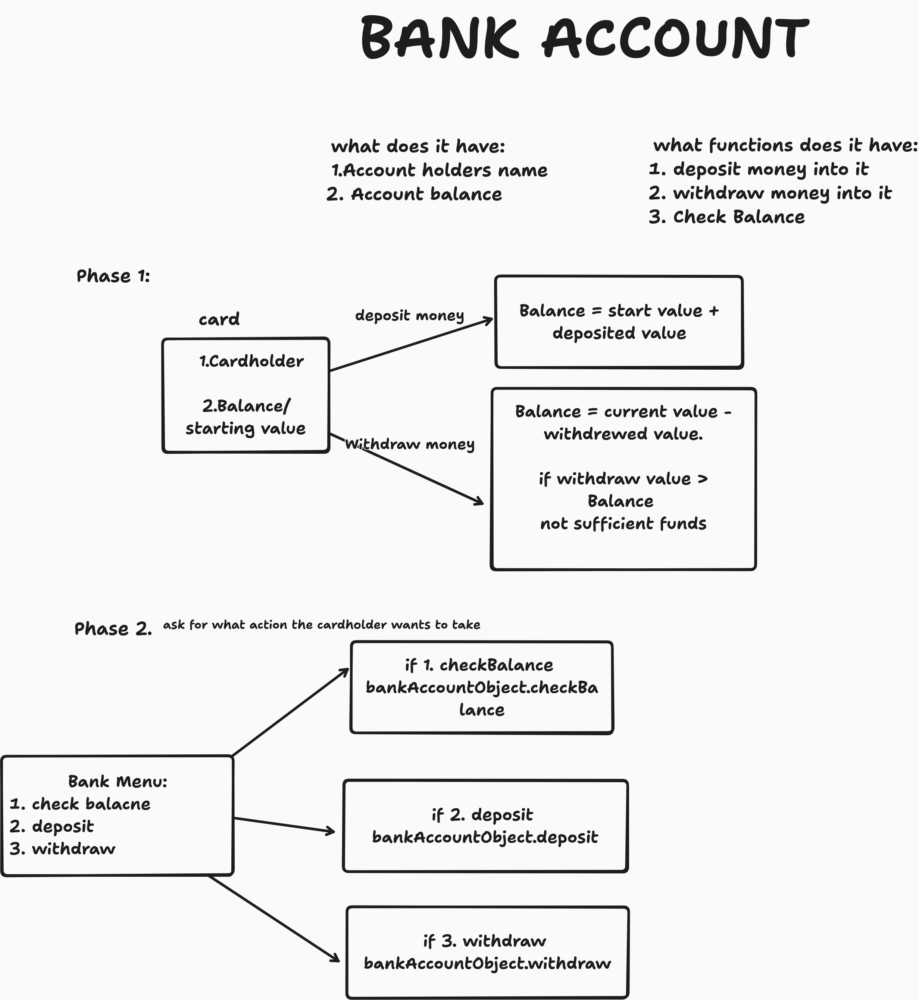
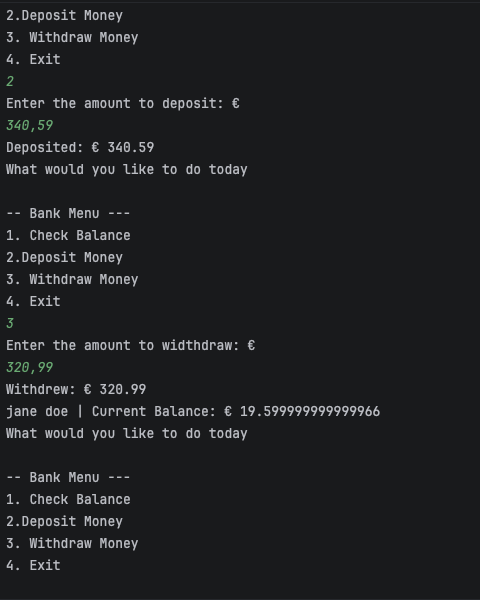
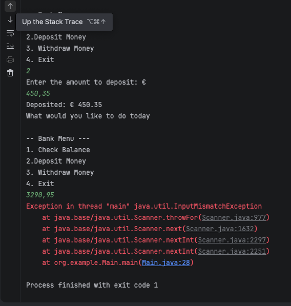

# Java Banking System CLI

A console-based banking application built to practice Java fundamentals — OOP, input handling, and control flow — as part of a hands-on Java learning path (roadmap.sh/java).

## Features

- Create an account with a cardholder name
- Deposit funds (rejects non-positive amounts)
- Withdraw funds (validates against balance and rejects non-positive amounts)
- Check current balance
- Menu-driven interaction loop (runs until the user exits)

## Design

The class structure and logic were sketched out before writing any code:



## How it works

- `BankAccount` holds account state (`name`, `balance`) and business logic (`deposit`, `withdraw`, `checkBalance`). It has no knowledge of user input — it just exposes methods.
- `Main` handles all user interaction: reading input via `Scanner`, displaying the menu, and dispatching to the right `BankAccount` method based on user choice, inside a `do-while` loop.

## Running it
Clone the repo and open it in IntelliJ IDEA (or your preferred Java IDE) as a Maven project — it'll auto-detect `pom.xml` and resolve dependencies. Run `Main.java` directly (right-click → Run, or the green arrow in the gutter).

```bash
git clone https://github.com/debz-cpu/java-banking-system-cli.git
```

## Example run





## What's next

- Custom exceptions (`InsufficientFundsException`) instead of print-based error handling
- `SavingsAccount` / `CheckingAccount` subclasses via inheritance
- Transaction history via File I/O
- Unit tests (JUnit)

## Tech

Java, Maven